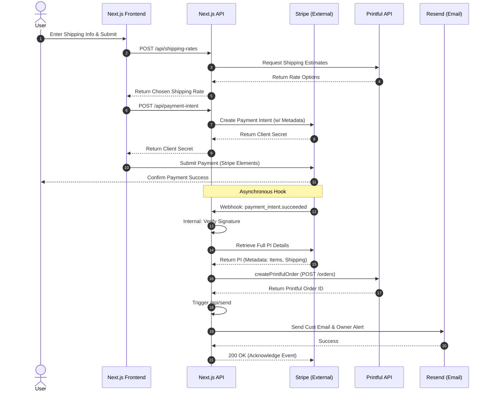

# Tech Babes

This is an ecommerce site I designed for my personal shop. 
Prior to this, my products were only available through Etsy. 
I wanted a more personalized site to really showcase what the brand and vision is all about. 

🔗 Live Site: [techbabes.dev](https://www.techbabes.dev/)

### Current Features (MVP)
- Browse products synced from Printful via API
- Add to cart and manage quantities
- Checkout with Stripe
- Order confirmation + contact form via Resend + React Email
- Address validation using Country-State-City library
- Form validation with Zod

### Upcoming Features
- An educational/lifestyle blog 
- Dark/light mode toggle
- Terminal style product detail page
- Easter egg discount 
- Mini games

### Tech Stack Diagram
A high-level overview of the app's architecture, showing how the Next.js frontend 
and API routes interact with third-party services like Stripe, Printful, and Resend.

### Order Flow
This sequence diagram walks through the full checkout-to-fulfillment lifecycle.
From the user submitting shipping info, to the order being created in Printful, 
and confirmation emails sent with Resend.

